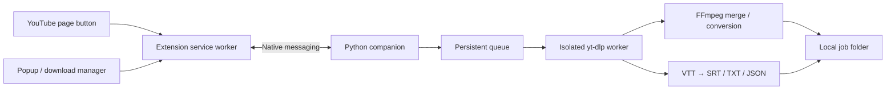

# SaveIt4U

A Chrome/Edge extension with a local Python download companion. Save individual YouTube videos and Shorts, their audio, and available caption tracks to your computer.

**Stack:** plain JavaScript, Manifest V3, Python 3.11+, yt-dlp, FFmpeg/FFprobe, and Node 22+ or Deno 2.3+. No frontend build step or remote backend.

## What works

- Video with audio: highest available source quality in MKV, or H.264/AAC MP4 for broader playback compatibility. Resolution limits include 360p through 4K; **Best available** can use higher resolutions if the source provides them.
- Audio: M4A, MP3, or Opus. Prefer matching source audio for M4A/Opus; convert when needed. MP3 uses V0 encoding.
- Captions: choose an available language, prefer human captions, optionally allow automatic captions. Save original VTT plus timestamped TXT, SRT and JSON. Rolling automatic captions receive overlap deduplication; manual captions preserve repeated dialogue.
- Persistent sequential queue, progress, transfer speed, per-stream progress, ETA, pause, resume, cancel, retry, and open-folder controls.
- A YouTube/Shorts page button, context menu, toolbar popup, and full download manager.
- Companion health checks and a Windows x64 portable FFmpeg installer with SHA-256 verification.

## Windows quick start

1. Install [Python 3.11+](https://www.python.org/downloads/) and [Node 22+](https://nodejs.org/en/download) or [Deno 2.3+](https://docs.deno.com/runtime/getting_started/installation/). Keep Python available as `python` in your terminal.
2. From this project folder, run:

   ```powershell
   powershell -ExecutionPolicy Bypass -File scripts/setup.ps1 -InstallFFmpeg
   ```

   This creates `.venv`, installs the companion, and puts FFmpeg/FFprobe under `.tools/ffmpeg/bin`. It does not modify your system PATH. The portable build comes from [Gyan's Windows builds](https://www.gyan.dev/ffmpeg/builds/), a distributor linked by [FFmpeg's download page](https://ffmpeg.org/download.html). If FFmpeg and FFprobe are already on PATH, omit `-InstallFFmpeg`.

3. Open `chrome://extensions` or `edge://extensions`, enable **Developer mode**, choose **Load unpacked**, and select this project's `extension` folder. Pin SaveIt4U to the toolbar.
4. Copy its extension ID and register the local companion using the project virtual environment:

   ```powershell
   .venv\Scripts\python.exe scripts\register_host.py --extension-id YOUR_32_LETTER_EXTENSION_ID
   ```

   Registration uses your own user account; administrator privileges are unnecessary. Run the command again for an Edge ID, or repeat `--extension-id` to allow multiple IDs. Moving the project requires re-registration.

5. Restart the browser if you installed Node/Deno or changed PATH. Open SaveIt4U → **Setup** → **Check connection**. All dependencies should show as available.
6. Open a video or Short and click the page's **SaveIt4U** button, or open the toolbar popup. Find the video, choose the media type, quality, and caption language, and add it to the queue.

Default output: `~/Downloads/SaveIt4U/<job-id>/`. Each job has its own folder to prevent filename collisions. Change the output folder in Setup; existing jobs retain their original destinations.

If your existing `.venv` was interrupted during installation and lacks pip, delete only that project-local environment and recreate it with `python -m venv .venv`, or repair it with `python -m pip --python .venv install -e .`.

## Linux / macOS development

Install Python 3.11+, FFmpeg/FFprobe and a supported JS runtime with your package manager, then:

```sh
python3 -m venv .venv
.venv/bin/python -m pip install -e .
.venv/bin/python scripts/register_host.py --extension-id YOUR_32_LETTER_EXTENSION_ID
```

Load `extension/` unpacked in Chrome/Chromium/Edge. The registration script writes user-scoped native manifests into the standard browser directories. These installer paths are implemented; platform-specific browser installation still needs verification on those operating systems. Firefox support is not included.

## Design and security



The browser's [native messaging protocol](https://developer.chrome.com/docs/extensions/develop/concepts/native-messaging) connects the extension to the companion over stdin/stdout. No HTTP control server or public port is used. The registered manifest allows specific extension IDs, and the host verifies caller origins. Content scripts can open the manager but cannot invoke filesystem commands. The extension does not read browser cookies, passwords, or arbitrary browsing history.

All incoming video URLs must be HTTPS links on an exact YouTube allowlist with a valid 11-character video ID. Tracking and playlist parameters are stripped. Media choices are validated enums; the companion offers no shell command API. Worker subprocesses use argument arrays. Titles render with `textContent`, and files use yt-dlp's sanitized names inside UUID job directories. Download URLs and complete extractor payloads are never sent to the UI.

YouTube extraction uses installed [yt-dlp EJS](https://github.com/yt-dlp/yt-dlp/wiki/EJS) with a supported local JavaScript runtime. Runtime version checks run during health checks. Remote solver components are disabled. Video/audio merging follows [yt-dlp's FFmpeg integration](https://github.com/yt-dlp/yt-dlp#dependencies).

One native companion owns a queue at a time. Two browsers cannot simultaneously own the same queue; close the other browser connection before switching. Two metadata inspections can run concurrently. Media jobs run sequentially with up to four parallel fragments when the transport supports fragmentation.

## Resume and transcript behavior

- Closing the popup or manager leaves the service worker's native port connected, so downloads continue while the browser stays open. Closing the browser pauses unfinished jobs. Reopening restores paused jobs; explicitly resume them.
- Pause terminates the worker process tree and retains `.part` files. Resume starts extraction again and uses available partial files. Servers and expiring YouTube URLs can prevent byte-perfect continuation. A pause during merging/conversion may need to repeat that stage.
- Percentages and ETA refer to the current media stream. They can reset when downloading switches from video to audio. Final completion happens after merging/conversion and requested caption processing.
- A caption download failure leaves successfully downloaded media intact, with a visible warning. A transcript-only failure fails the job.
- Clearing finished history keeps downloaded files and partials on disk. Cancel also keeps partial files; remove them manually if no longer needed.
- Available quality depends on the source. MP4 selects compatible H.264/AAC tracks and may have a lower maximum resolution than MKV. This app does not upscale media.
- Existing captions are exported; speech-to-text generation, translation, playlist/batch imports, cookies/login, live-stream recording, DRM and access restriction bypass are not implemented. Use it for content you own or have permission to save.

## Updates and troubleshooting

YouTube can change its endpoints and challenge requirements. No downloader can guarantee every video will always work. Keep the engine updated:

```powershell
.venv\Scripts\python.exe -m pip install --upgrade "yt-dlp[default]"
```

For an upstream fix available only in a development release, [yt-dlp documents its nightly channel](https://github.com/yt-dlp/yt-dlp#update):

```powershell
.venv\Scripts\python.exe -m pip install --upgrade --pre "yt-dlp[default]"
```

Close/reopen the browser after changing dependencies. If the companion is not found, check that registration used the **same virtual environment**, the extension ID is correct, and the project has not moved. If YouTube asks for sign-in or returns a rate-limit error, the job reports it; account/cookie support is outside this version.

State lives in `%LOCALAPPDATA%/SaveIt4U/state.json` on Windows or `~/.local/share/saveit4u/state.json` elsewhere. If saved state becomes unreadable, the host reports its path without silently deleting history. `SAVEIT4U_DATA_DIR` can override this for an isolated developer profile.

Unregister without deleting downloads:

```powershell
.venv\Scripts\python.exe scripts\register_host.py --extension-id YOUR_EXTENSION_ID --unregister
```

This removes all SaveIt4U registrations for the current user on the supported browser paths. Remove the extension separately from the browser extensions page.

## Verification and packaging

```powershell
.venv\Scripts\python.exe -m unittest discover -s tests -v
npm run check
npm test
.venv\Scripts\python.exe scripts\package_extension.py
```

Python tests cover URL restrictions, framed Unicode messages, atomic persistence, process lifecycle, queue recovery, transcript timing, real yt-dlp format selection, and native-host subprocess communication. Media integration tests create a one-second local video/audio fixture, serve it on loopback, run real yt-dlp downloads and FFmpeg merging/conversion, and verify final streams with FFprobe. They skip when FFmpeg, FFprobe, yt-dlp or the JS runtime is missing. Only the extractor is replaced for those repeatable tests.

Node tests cover URL normalization, extension permissions, native response correlation, sender restrictions and disconnect handling. CI runs on Windows and Linux; Linux installs FFmpeg for the media tests. Live YouTube behavior and Chrome/Edge native registration need manual smoke checks and can depend on network/region/account restrictions.

Packaging creates `dist/saveit4u-extension-0.1.0.zip`. Extract the ZIP before using **Load unpacked**. The local companion is installed separately; browser stores cannot install a native companion themselves. No store submission or publication is performed.

See [the local verification record](docs/verification.md) for completed live and automated checks, and the remaining browser installation check. For an isolated, clearly marked UI demo, run `python scripts/preview_server.py` and open the loopback URL it prints. The demo uses simulated downloads and is never included in the extension package.
