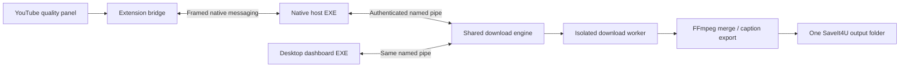

# SaveIt4U 0.2.1

A Windows desktop downloader and Chrome/Edge extension with automatic pairing, an on-video quality panel and a shared persistent download queue.

## Install — no commands or extension IDs

1. Open **SaveIt4U-Setup-0.2.1.exe** and click **Install**. Python, FFmpeg/FFprobe, Node, yt-dlp and its YouTube solver are included.
2. Click **Open SaveIt4U**. The desktop dashboard shows whether the extension is connected.
3. Add the extension. The current private build provides `saveit4u-extension-0.2.1.zip`; extract it and use Chrome/Edge's **Developer mode → Load unpacked**. The desktop app's **Install / locate extension** button opens its included extension folder. There are no terminal commands or ID-copy steps. Browser installation itself requires the user's action.
4. App and extension connect automatically, in either installation order. Connection states are **Connected**, **Disconnected**, **Connecting** and **Connection Error**, with automatic retries.
5. Open a YouTube video or Short. The quality panel appears automatically. Choose a format and optional caption language, then click a quality to start downloading immediately.

Default output: `~/Downloads/SaveIt4U/`. All new finished files go directly into this one folder:

```text
SaveIt4U/
  English Speaking Practice.mp4
  English Speaking Practice (2).mp4
  Python Tutorial.mkv
  Python Tutorial.en.srt
  Python Tutorial.en.txt
```

Windows-invalid title characters are replaced and very long names are shortened. Matching titles receive numeric suffixes without overwriting existing files. Temporary streams and partial transfers live in the private application data folder, not per-video output subfolders. Existing 0.1 completed downloads retain their historical location; unfinished legacy jobs publish new finished output into the current main folder.

See the [Roman Urdu quick-start](docs/quick-start-ur.md).

## Download experience

- Video + original audio: MKV supports the highest available source quality, including 4K/8K when offered. MP4 selects compatible H.264/AAC tracks and can have a lower maximum resolution. No video upscaling or re-encoding is used for merging.
- Audio: source-compatible M4A/Opus, or MP3 conversion.
- Captions: available human or automatic caption languages. Export original VTT plus timestamped TXT, SRT and JSON. Manual dialogue preserves repeated lines; rolling automatic captions receive overlap cleanup.
- The page panel lists actual available qualities and combined video/audio download sizes. Unknown sizes remain unknown; approximate bitrate-derived sizes have a `~` marker. Container output size can differ slightly after merging.
- Both dashboards show download speed, downloaded/total bytes, ETA, progress and system receive rate. Speed can display per second or per minute. System receive uses OS-wide interface counters and includes other apps, adapters and VPN traffic.
- Aggregate progress covers video and audio together. It does not reset when audio starts. Estimates update as real response sizes arrive; unknown totals show an indeterminate indicator.
- Pause, resume, cancel, retry, folder selection and open-folder controls. Closing a browser port or dashboard does not stop the shared engine. A computer/engine restart restores unfinished jobs; installer updates resume jobs that were active, while preserving user-paused jobs.
- Native port retries use bounded backoff and a Chrome alarm for worker recovery. A new engine reattaches existing browser bridges. Snapshot recovery restores the queue on reconnect.
- Metadata requests are coalesced and cached briefly. Media transfers use 1 MB buffers and up to eight concurrent fragments, without an artificial speed limit. Actual speed depends on the connection, YouTube/CDN limits and the transport; ordinary progressive HTTP transfers are not falsely reported as eight-way ranged downloads.
- Detection failure provides Detect again and a manual YouTube-link fallback. Active live streams, unavailable/authenticated content, DRM bypass, other video websites and speech-to-text generation are outside this release.

## Automatic pairing and security

The installer registers a fixed extension identity derived from the extension's public manifest key. It writes an exact native-origin allowlist for Chrome, Edge and Chromium under the current user's registry. It does not scan private browser profiles, use wildcard origins, or silently install a browser extension. [Chrome documents stable manifest identities](https://developer.chrome.com/docs/extensions/reference/manifest/key) and [native host registration](https://developer.chrome.com/docs/extensions/develop/concepts/native-messaging).



Production uses no HTTP control server or TCP listener. Per-user IPC is authenticated with a local random key and exchanges size-limited JSON bytes, never pickle. Browser bridges validate their caller origin. Content scripts may inspect/download only the current top-level YouTube video; filesystem settings and other controls require an extension page. A quality click must be a trusted browser event. Incoming URLs use exact HTTPS YouTube hosts and validated video IDs. There is no generic shell command API, cookie extraction, analytics or cloud upload.

The installation payload and individual application files are SHA-256 verified. Installation uses a checked staging directory, rollback and current-user registration. Updates briefly enter maintenance mode so bridges and the GUI release old files and the engine saves continuation state. Same-volume output publication uses atomic, non-overwriting hardlinks; cross-volume/Windows exFAT publication stages a complete file before a non-overwriting move. Completed work files are cleaned up. Cancelled partials remain available in private work storage; clearing queue history retains finished output files.

## Public release requirements

The EXE is an **unsigned private build**, and the extension is not yet published to Chrome Web Store or Edge Add-ons. Public distribution still needs publisher code signing and store submission. No browser or Windows security barrier is bypassed. For a store release, the developer must synchronize the store's assigned public key/ID in `identity.py` and `manifest.json` and rebuild the installer. This is a developer release step, not an end-user pairing step.

The installer currently supports Windows x64. Source development and the IPC backend also support Unix; no polished Linux/macOS installer is provided. Use the application for content you own or have permission to save. YouTube changes and regional/account restrictions can affect availability; tested operation is not a guarantee for every video or future change.

## Developer setup and builds

End users use the EXE. Developers need Python 3.11+, a supported Node 22+ or Deno 2.3+ runtime, and FFmpeg/FFprobe. Source checkout:

```powershell
python -m venv .venv
.venv\Scripts\python.exe -m pip install -e ".[build]"
.venv\Scripts\python.exe scripts\install_ffmpeg.py
.venv\Scripts\python.exe scripts\register_host.py
```

Registration discovers the release ID automatically. Load `extension/` unpacked. The portable FFmpeg downloader verifies the [Gyan build](https://www.gyan.dev/ffmpeg/builds/) linked by [FFmpeg](https://ffmpeg.org/download.html). The Windows build copies a supported Node executable from the build machine and includes that version's license. Keep bundled vendor licenses with distributions.

```powershell
.venv\Scripts\python.exe -m unittest discover -s tests -v
npm test
npm run check
.venv\Scripts\python.exe scripts\build_windows.py
.venv\Scripts\python.exe scripts\smoke_windows.py --live
```

Outputs: `dist/SaveIt4U-Setup-0.2.1.exe`, `dist/SaveIt4U/`, and `dist/saveit4u-extension-0.2.1.zip`. `build_windows.py --output-dir PATH` can create an isolated release while an older build is running. The manual **Windows installer** GitHub Actions workflow builds and checks downloadable artifacts without automatically publishing a release.

0.2.1 fixes Windows frozen-worker `charmap` failures for Unicode titles and caption-language names, including English videos whose caption metadata contains “Māori”. Worker JSON and diagnostics now use explicit UTF-8, independent of the Windows console code page. Existing extension identity and pairing are unchanged; updating the desktop installer is sufficient to receive this fix.

`smoke_windows.py` installs into a private workspace test folder with browser registration disabled, strips system Node/Python/FFmpeg from PATH, checks bundled dependencies and exchanges real native frames with the frozen app. `--live` additionally inspects and downloads a short public YouTube fixture, exports captions, and verifies final audio/video streams with the bundled FFprobe.

For interactive integration checks, `scripts/workflow_server.py` is a **development-only loopback harness**. It runs the actual extension scripts against the real frozen native host through a browser transport adapter. The engine, native protocol, IPC, worker processes, network counters and file publication are real. The page explicitly identifies this adapter; the harness is never included in the extension or installer. `scripts/preview_server.py` is a separate, clearly marked simulated layout preview.

Data: `%LOCALAPPDATA%/SaveIt4U/` on Windows, or `~/.local/share/saveit4u/` for source Unix development. `SAVEIT4U_DATA_DIR` supports isolated test profiles. A developer portable build may use an adjacent `portable-data.json` containing an absolute `data_dir`; this file is not part of a normal release.

See [the verification record](docs/verification.md) for completed checks and their limits.
